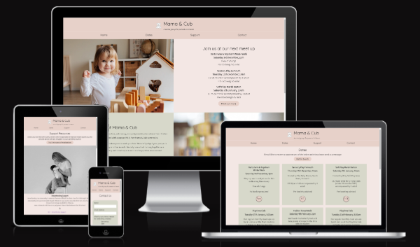
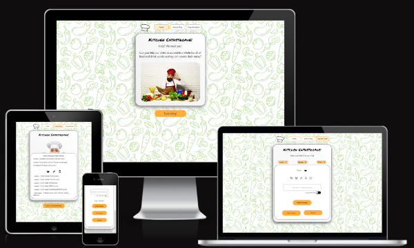
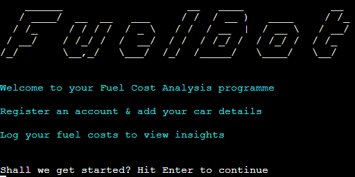
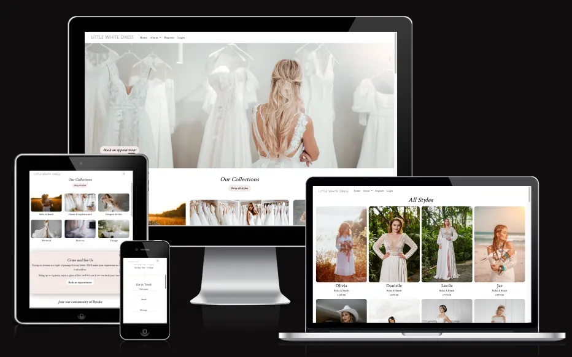
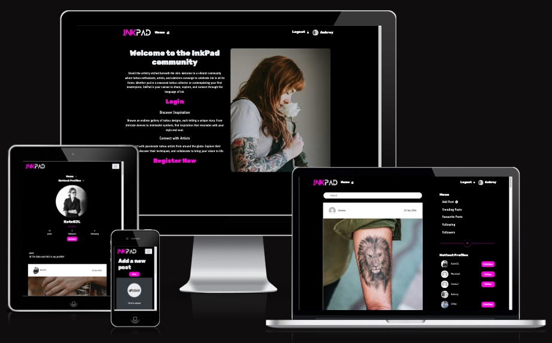

# Kate Llewellyn

## Full-Stack Software Development student with Code Institute

### About me
Hi, my name's Kate and I recently completed a **Level 5(EQF) Diploma in Full-Stack Software Development** with the **Code Institute**. I'm committed to a career move into Software Development and consider some of my key strengths to be:
 
:arrows_counterclockwise: UX Design
 
:art: UI Design
 
:page_facing_up: Documentation
 
:speech_balloon: Communication
 
:busts_in_silhouette: Teamwork
 
 
Check out my [Portfolio Projects](#portfolio-projects) completed as part of my Code Institute course below :point_down:
 
 
I've always been drawn to coding and I think this is because of my propensity for method and order. I love that writing code allows me to be organised and methodical but also enables my creativity (something I would not have considered myself capable of in the past!).

Some of my other interests include:
 
:knife: Cooking
 
:video_game: Gaming
 
:blue_book: Reading
 
:racing_car: Motorsport
 
 
I'm particularly interested in working on projects around :recycle: renewable energy and climate change :earth_africa:

 
My pronouns are she/her/hers

---

### Contact Details

Find me on [LinkedIn](https://www.linkedin.com/in/llewellynksj/)
 
Email me at llewellyn.ksj@gmail.com

---

### Key Skills
#### Languages

#### Frameworks & Libraries

#### Databases

#### Hosting

#### Version Control / IDE's

#### I'm learning now

---

### Portfolio Projects
Below are listed the Portfolio Projects I have created as part of my Diploma with the Code Institute

| Title| Snapshot | Summary | Grade |
| :---: | :----: | :----: | :----: |
| [Mama & Cub](https://github.com/llewellynksj/muma-and-cub) |  | Mama & Cub is a simple to use website aimed at bringing together parents and their children in the Exeter area of South Devon, UK. It is a fictional site created as my first Portfolio Project for my Code Institute Diploma. Built using HTML and CSS. | Distinction |
| [Kitchen Catastrophe](https://github.com/llewellynksj/kitchen-catastrophe) |  | Kitchen Catastrophe is a fun and light-hearted game aimed at anyone who loves a word problem and/or loves food and drink! It has been created for my second Portfolio Project as part of my Code Institute Diploma. Built using HTML, CSS and JavaScript. | Merit |
| [FuelBot](https://github.com/llewellynksj/fuelbot) |  | FuelBot is a simple tracking system to help vehicle users understand how much they are spending on fuel. This useful little tool can quickly analyse your average spend so that you can better manage your finances. Built using Python. | Merit |
| [Little White Dress](https://little-white-dress-ad94e830edef.herokuapp.com/) |  | Little White Dress was an idea born out of a real-world need; a close friend who is a wedding planner with a dream to open their own wedding dress store. A visitor to the LWD website can easily browse the products on sale, make a booking to attend the store and try on dresses, and join a community of brides who share recommendations. Built using the Django framework as well as HTML, CSS, JavaScript and Python | Merit |
| [InkPad](https://pp5-kl-c6a010106309.herokuapp.com/) |  | InkPad is social media platform designed to share, explore and connect with a community of users. The core aim of this web application is to promote and share tattoo designs, and to connect tattoo enthusiasts, artists, and admirers alike. Built using React JS (Back end built using Django REST) | Merit |
---

### Hackathons
Below are the Hackathon Projects I have partcipated in as part of my Diploma with the Code Institute

| Theme| Date | Project | Badges |
| :---: | :----: | :----: | :----: |
| Stamp Out the Stigma: Supporting Veterans’ Mental Health | 12th - 15th April 2023 | [CheckPoint](https://github.com/Vasi012/CheckpointSite) CheckPoint is a website that has been created to facilitate a peer-led support service to veterans dealing with mental health struggles. The blog style of the site allows veterans to share their own experiences and explore different ways of improving their health & wellbeing. Built using Django, Bootstrap, HTML, CSS and Python. Please note this site is currently not deployed and work is ongoing |  |
| May the 4th - A Star Wars Hackathon | 10th - 15th May 2023 | [DeathScape](https://github.com/alissatroiano/team-11) Use your Star Wars knowledge to escape the Death Star! In this star wars themed escape room game. Find the hidden mini-games, complete them all to unlock the sealed door and lead the others to safety. Can you escape from the falling ship? Built using HTML, CSS and JavaScript. [Visit the depolyed site](https://alissatroiano.github.io/team-11/) |  |
| Reimagining Women's Health | 22nd - 26th April 2024 | [FairPlay](https://api.eu.badgr.io/public/assertions/b8JGTCWgQU-pju9dxPgiGw?identity__email=llewellyn.ksj%40gmail.com)

---

### Other Qualifications & Certificates

| Subject| Organisation | Date | Notes |
| :---: | :----: | :----: | :----: |
| Politics with Sociology | Kingston University | 2013 | Awarded a 2.1 |
| Python (Basic) |  | March 2023 | [View Credential](https://www.hackerrank.com/certificates/28ae32eabdcf) |
| CSS |  | April 2023 | [View Credential](https://www.hackerrank.com/certificates/d298f40ffc0b) |
| Problem Solving (Basic) |  | August 2023 | [View Credential](https://www.hackerrank.com/certificates/7b15b5fe8ad0) |
| HTML |    Skills Assessment | October 2022 | |
| CSS |    Skills Assessment | May 2023 | |
| Django |    Skills Assessment | August 2023 | |
